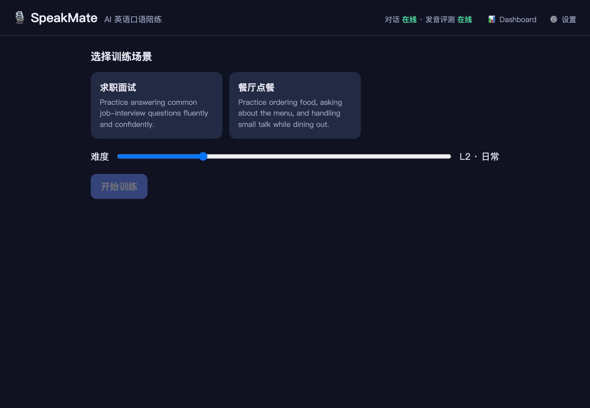
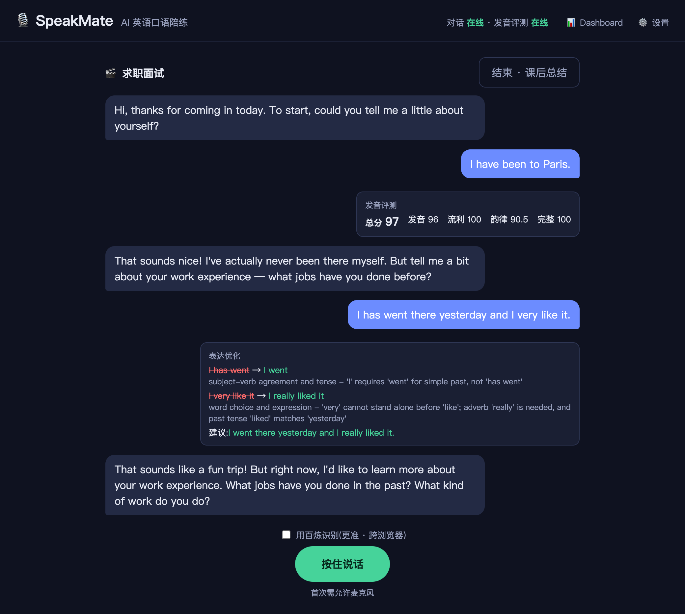
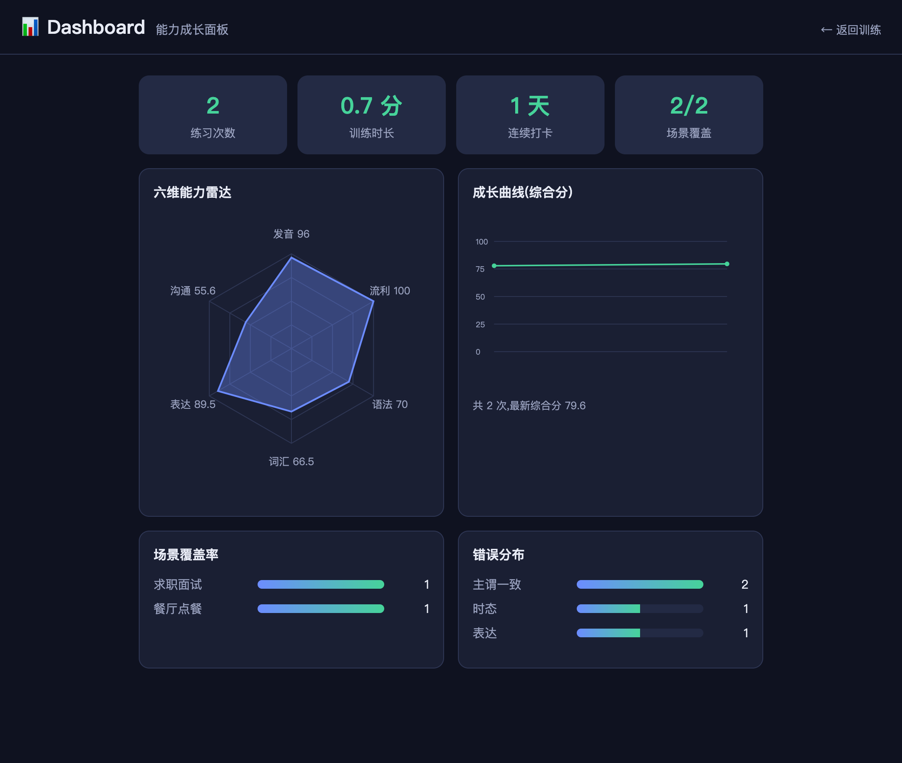
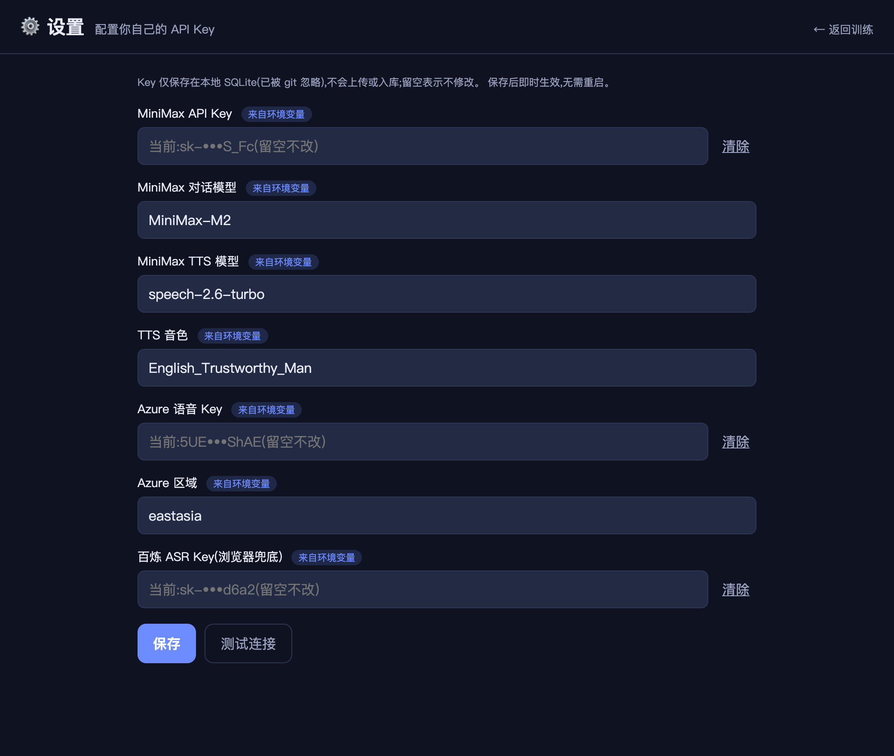

# SpeakMate — AI 英语口语陪练

在指定场景(面试 / 点餐 / 会议 …)下进行真实英语对话训练,提供**实时语音对话、发音评测、语法/表达纠错、课后总结与成长分析**。

完整设计见 [`design.md`](design.md);Demo 录屏脚本见 [`docs/DEMO.md`](docs/DEMO.md)。

## 截图

> 以下均为真实运行截图(真实 AI 回复 + 真实 Azure 发音分),非示意图。

| 选择场景 | 实时对话 + 发音/纠错反馈 |
|---|---|
|  |  |

| 成长 Dashboard | 设置页(配置自己的 Key) |
|---|---|
|  |  |

- **实时对话**:AI 全程在角色内;用户气泡下方是**真音素级发音四维分**(Azure)与**结构化纠错**(错误→原因→建议 + 整句润色)。
- **Dashboard**:六维雷达 + 成长曲线 + 场景覆盖 + 错误分布;发音/流利来自 Azure,无数据时留空不臆造。
- **设置页**:Key 打码回显、保存即热生效、可「测试连接」真实验证。

## 技术栈

| 能力 | 方案 |
|---|---|
| 对话 LLM | MiniMax(Anthropic 兼容端点) |
| TTS(AI 开口) | MiniMax 流式 TTS(WebSocket) |
| ASR(用户语音→文本) | 浏览器 Web Speech API(Chrome/Edge 主) + 百炼 Paraformer 兜底(Safari/Firefox 默认,Chrome 可选) |
| 发音评测 | Azure Pronunciation Assessment(音素级 GOP) |
| 后端 | Python 3.11 + Flask + gevent + SQLite |

## 快速开始

```bash
python3.11 -m venv .venv && source .venv/bin/activate
pip install -r requirements.txt

cp .env.example .env      # 填入你的 key(.env 已被 gitignore)
python scripts/check_connectivity.py   # 各外部依赖各打一发真实请求自检
pytest -q                 # 运行单测(走 Mock,不需要任何 key)

python app.py             # 启动 Web 应用,默认 http://127.0.0.1:5001
```

> **用 Chrome 打开**(语音识别依赖 Web Speech API),首次允许麦克风;**按住「按住说话」** 即可开始口语对话。
> macOS 上 5000 端口被 AirPlay 占用,故默认 5001;可用 `PORT=xxxx python app.py` 改端口。
> 发音评测需 ffmpeg(把浏览器录音转成 16k WAV 给 Azure)。

> **无 key 也能跑**:未配置某项 key 时,该能力自动进入 Mock/降级模式并明确标注,
> 不会崩溃——方便在没有凭证时体验与评审。

### 需要的 key

- `MINIMAX_API_KEY` — 对话与 TTS([platform.minimaxi.com](https://platform.minimaxi.com))
- `AZURE_SPEECH_KEY` + `AZURE_SPEECH_REGION` — 发音评测(Azure Speech 有免费额度)
- `DASHSCOPE_API_KEY` —(可选)百炼 ASR 兜底,非 Chrome 浏览器的语音识别([bailian.console.aliyun.com](https://bailian.console.aliyun.com))

> 也可以**不改 `.env`**,直接在应用内 **⚙️ 设置页(`/settings`)** 填写自己的 Key:存本地 SQLite、保存即生效、可一键「测试连接」。设置页的值优先于环境变量。

## 当前进度

- [x] 接入层骨架:`AIService` 统一入口 + MiniMax 对话/TTS + Azure 发音评测(**三条线均实测连通**)+ Mock/降级
- [x] 对话引擎与场景配置:`conversation.py` + Interview/Restaurant 场景,流式回复、上下文窗口、L1~L5 难度(实测多轮对话在角色内)
- [x] 语法/表达纠错:`grammar.py` 延迟纠错,结构化「错误句→原因→推荐」,LLM 解析失败自动重试再降级规则(实测纠错精准)
- [x] 课后总结 + 六维能力模型:`report.py` 总结(优秀表达/高频错误/推荐/建议)+ `skills.py` EWMA 更新;声学维度无数据时置 None 不臆造
- [x] Flask 应用 + SPA 前端:选场景→语音对话(Web Speech ASR + 流式回复 + MiniMax TTS 播放)→ 逐轮发音评分/纠错 → 课后总结+六维(8 个接口 curl 实测通)
- [x] Dashboard + SQLite 持久化:`/dashboard` 六维雷达 + 成长曲线 + 练习量/打卡/场景覆盖/错误分布(纯 SVG 无图表库);发音分汇入六维;接入层对 MiniMax 故障(429/超时)自动降级不崩
- [x] 设置页 `/settings`:用户在 UI 配置自己的 Key(MiniMax/Azure/百炼),存本地 SQLite、回显打码、保存即热生效、可"测试连接"真实验证
- [x] 百炼 ASR 兜底:Safari/Firefox 默认走服务端百炼 Paraformer 转写,Chrome/Edge 可勾选切换;录音复用发音评测链路(实测转写准确)
- [x] Android App(WebView 套壳):`android/` 完整可构建工程,加载服务器、放行麦克风、自签 HTTPS;Android 无 Web Speech 时自动用百炼 ASR(见 [`android/README.md`](android/README.md))
- [x] AI 自对弈验证:`scripts/selfplay.py` 两个 AI 在同一场景互问互答,跑通对话→纠错→课后总结 + 评委评分——**无需开口即可验证对话自然度与纠错精准度**

### 自对弈验证(无需开口)
```bash
python scripts/selfplay.py interview 4 2 A2   # 场景 轮数 难度 学习者级别
```
一个 AI 演场景角色、一个 AI 扮学习者(带真实错误),自动跑完整链路并由「评委」模型给自然度/角色保持打分。发音评测因无真实人声会如实跳过。

## AI 协作说明

本项目开发中使用了 AI 辅助工具(Claude Code 等),如实声明:

- **运行时 AI 能力**:对话/纠错/总结 = MiniMax(主)/ Hermes(兜底);TTS = MiniMax 流式;
  ASR = 浏览器 Web Speech API;发音评测 = Azure Pronunciation Assessment。
- **选型有据**:发音评测最初设想用 MiniMax 多模态,经**实测确认其聊天端点收不到音频、
  且无发音评测产品**后改接 Azure(音素级)。决策与证据见 `design.md` §9/§12。
- **承诺**:提交的功能均可运行、测试真实通过;README/demo 所述能力与代码一致,
  不伪造功能、不伪造测试与演示;走降级/Mock 处,文档与 UI 均如实标注。
