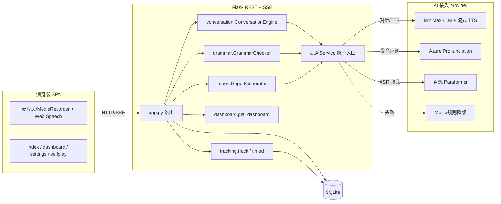
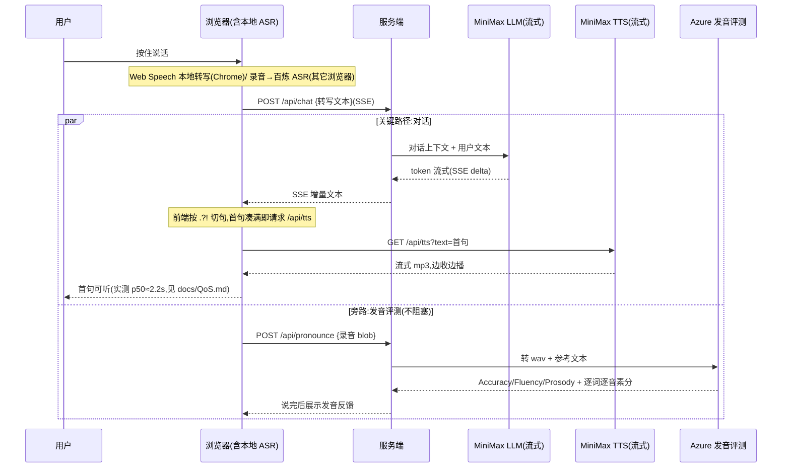
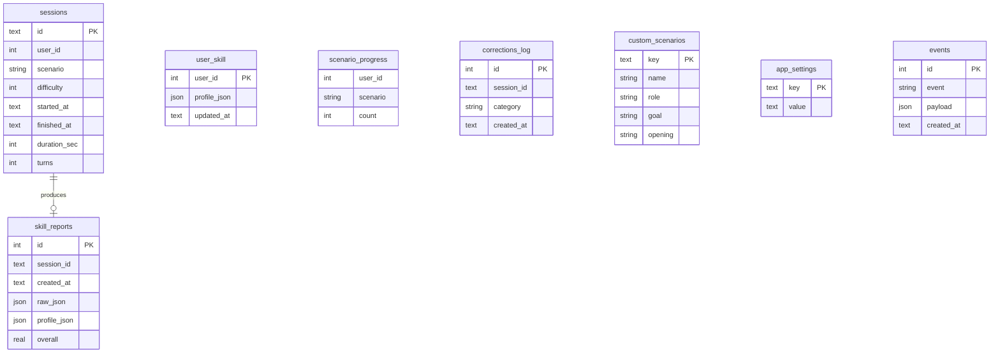

# SpeakMate — AI 英语口语陪练 · 设计文档

| 项 | 内容 |
|---|---|
| Version | 4.0(已与代码现状对齐) |
| Runtime | Python 3.11 |
| Backend | Flask(REST + SSE 流式);TTS 内部用 WebSocket 连 MiniMax |
| Frontend | 原生 HTML/CSS/JS + Jinja2 模板(无前端框架,纯 SVG 画图,离线可用) |
| Storage | SQLite |
| 对话 LLM | MiniMax 直连(`api.minimaxi.com/anthropic`,文本) |
| TTS(AI 开口) | MiniMax 流式 TTS(`wss://api.minimaxi.com/ws/v1/t2a_v2`,多音色/多语言) |
| ASR(用户语音→文本) | 浏览器 Web Speech API(Chrome/Edge 主)/ 百炼 Paraformer 兜底(Safari/Firefox 默认,Chrome 可选) |
| 发音评测 | **Azure Pronunciation Assessment**(真·音素级 GOP) |
| 失败降级 | 任一外部失败 → Mock/规则兜底,不抛 500(Hermes 兜底为**预留接口,未实现**) |
| 仓库 | `git@github.com:zhoutingunl/speak_mate.git` |

> **文档与代码一致性声明(v4.0):** 本文档已逐节核对源码,移除未落地的设计(原 §:gevent/客户端 WebSocket 通道、APScheduler 学习路径、Hermes 兜底、Bootstrap 等);仍为设想/预留的项均显式标注"未实现/预留"。实测数字见 [`docs/QoS.md`](docs/QoS.md)。

> **接入选型说明(均经实测/文档核对):** MiniMax 文本对话与流式 TTS 已实测可用;MiniMax **不提供** ASR/发音评测产品(其聊天端点收不到音频,文档仅有 TTS/声音克隆)。因此 ASR 走浏览器原生(零网络跳、零成本),**发音评测改用 Azure**——业界标准的音素级评测,一次调用返回转写 + Accuracy/Fluency/Completeness/Prosody + 逐词逐音素分。详见 §9、§12。

> 设计原则:**先把一条「语音对话 → 真发音评测 → 纠错 → 课后总结」的闭环做真做稳,再做广。** 凡是技术上拿不到真实数据的能力,宁可砍掉或降级标注,绝不在 demo / README 里"声称但不可用"。

---

## 目录

1. [项目简介](#1-项目简介)
2. [用户洞察与产品定位](#2-用户洞察与产品定位)
3. [用户画像](#3-用户画像)
4. [MVP 取舍与边界(重要)](#4-mvp-取舍与边界重要)
5. [核心功能](#5-核心功能)
6. [创新点](#6-创新点)
7. [系统架构](#7-系统架构)
8. [语音端到端架构与延迟预算(核心)](#8-语音端到端架构与延迟预算核心)
9. [AI 接入层设计](#9-ai-接入层设计)
10. [Prompt 设计](#10-prompt-设计)
11. [对话引擎设计](#11-对话引擎设计)
12. [发音评测设计(诚实链路)](#12-发音评测设计诚实链路)
13. [纠错策略](#13-纠错策略)
14. [六维能力模型与评分算法](#14-六维能力模型与评分算法)
15. [学习路径与 Dashboard](#15-学习路径与-dashboard)
16. [错误处理与降级设计](#16-错误处理与降级设计)
17. [QoS 指标](#17-qos-指标)
18. [Evaluation Framework](#18-evaluation-framework)
19. [埋点设计](#19-埋点设计)
20. [数据模型(ER)](#20-数据模型er)
21. [项目结构](#21-项目结构)
22. [测试设计](#22-测试设计)
23. [Demo 设计](#23-demo-设计)
24. [商业化思考](#24-商业化思考)
25. [安全设计](#25-安全设计)
26. [Git 工程规范](#26-git-工程规范)
27. [AI 协作说明](#27-ai-协作说明)
28. [Definition of Done](#28-definition-of-done)

---

## 1. 项目简介

SpeakMate 是一款 **AI 英语口语训练平台**,帮助用户在**指定场景**下进行真实对话训练。

支持场景:**内置 面试(Interview)/ 点餐(Restaurant)两个**,并支持**用户自定义任意场景**(填名称 + 想练什么,LLM 自动生成英文角色/目标/开场白,见 §5.1)。

围绕场景对话提供四件事的闭环:**实时语音对话 → 发音评测 → 语法/表达纠错 → 课后总结与成长分析**;并提供 Dashboard 成长面板、设置页(配 Key/音色)、AI 自对弈验证。

---

## 2. 用户洞察与产品定位

**洞察**:用户缺的不是英语知识,而是**真实的、低社交压力的语言环境**。传统路径"背单词 → 刷题 → 看视频"始终停在"知道"，跨不到"会说"。

**SpeakMate 要解决的就是「知道 → 会说」之间的鸿沟。**

**定位**:不是聊天机器人,不是翻译软件,而是一个**有反馈、可量化、能复训的 AI 英语私教**。

**核心价值**:让用户**敢说 → 会说 → 说得自然**,并用数据让"进步"看得见。

---

## 3. 用户画像

| 人群 | 典型诉求 | 主打场景 |
|---|---|---|
| 学生 | 四六级 / 雅思 / 托福 / 升学面试 | Interview、Daily Chat |
| 职场用户 | 商务沟通、海外会议、客户对接 | Meeting |
| 出国用户 | 旅行/居留中的真实交流 | Restaurant、Hotel、Immigration |

---

## 4. MVP 取舍与边界(重要)

评分明确要求"**能否做减法而非加法**、产品取舍是否自洽"。本项目为有限工期的个人作品,**刻意收敛范围,保证核心闭环真能跑**,而非样样半成品。

### P0 — 必做且必须真能跑通(demo 主线)
- **2 个场景**(Interview + Restaurant)的完整对话。
- **实时语音**:录音 → ASR → LLM 回复 → TTS 播放,首句流式可听。
- **真发音评测**:基于用户**真实音频**的多维评分(详见 §12)。
- **语法/表达纠错**:延迟纠错为主,结构化反馈。
- **课后总结**:本次会话的亮点 / 高频错误 / 推荐表达 / 训练建议。

### P1 — 时间允许则做(加分,非阻断)
- 更多场景(Hotel / Meeting / Immigration / Daily Chat)、自定义场景。
- Dashboard(雷达图 + 成长曲线 + 场景覆盖率)。
- 六维能力模型持久化与自适应推荐。

### P2 — 本期明确不做(并写清"为什么不做")
- **A/B Test 在线实验**:单人作品没有真实流量,跑不出统计显著的结论,硬塞一个空框架属于"做加法凑功能"。**本期只保留可切换的策略开关(实时/延迟纠错、严格/鼓励式 Prompt)和离线对照评测,不做在线分流。**
- **企业版多租户 / 团队管理**:与个人作品核心价值无关,属于商业畅想,放在 §24 文字说明即可,不进代码。
- **App / 小程序端**:Web 已能完整演示价值,多端是工程量陷阱。

> 取舍逻辑:**深度 > 广度**。先用 2 个场景把"对话自然度、语音流畅度、纠错精准度、可量化反馈"四个评审关注点打穿,再横向扩场景(扩场景几乎是纯配置成本)。

---

## 5. 核心功能

### 5.1 场景训练(`scenarios.py`)
- **内置 2 个**:Interview、Restaurant。`Scenario` 数据类(key/name/role/goal/opening),按难度生成 system prompt;新增内置=加一份配置,无需改引擎。
- **用户自定义场景**(已实现):前端填「名称 + 想练什么(可中文)」→ `POST /api/scenarios` 用 LLM 生成英文 role/goal/opening → 存 `custom_scenarios` 表持久化 → 可删除(内置不可删)。

### 5.2 实时语音
- **按住说话**(push-to-talk):已实现,默认。
- **连续模式**(VAD 自动断句):**未实现(预留)**。

### 5.3 发音评测
基于 Azure 音素级评测输出四维分:**Pronunciation / Fluency / Prosody / Completeness**,见 §12。

### 5.4 语法 / 表达纠错
识别时态、介词、冠词、主谓一致等;表达优化如 `I very like it → I really like it`。见 §13。

### 5.5 课后总结
结构化输出:优秀表达、高频错误、推荐表达、下次训练建议。

### 5.6 成长报告(Dashboard)
`/dashboard` 展示六维雷达、综合分成长曲线、练习次数/时长/连续打卡、场景覆盖率、错误分布(基于 SQLite 持久化)。注:按 7/30/90 天分窗统计为预留,当前为全程趋势 + streak。

---

## 6. 创新点

| 创新点 | 说明 | 状态 |
|---|---|---|
| **AI 自对弈验证** | 两个 AI(考官 + CEFR 学习者带真实错误)同场景互问互答,跑完整链路并由"评委"模型打分——评审无需开口即可验收对话/纠错质量(`selfplay.py`,CLI + `/selfplay` 网页 + 朗读) | ✅ 已实现 |
| **六维能力画像** | Pronunciation/Fluency/Grammar/Vocabulary/Expression/Communication,EWMA 抗抖动;声学维度无数据置 None 不臆造 | ✅ 已实现 |
| **自定义场景(LLM 生成)** | 中文描述 → LLM 生成英文场景设定,持久化 | ✅ 已实现 |
| **音素级发音评测** | Azure 真音素级 GOP + `PronunciationProvider` 抽象 | ✅ 已实现 |
| **场景覆盖率 / 成长曲线** | Dashboard 纯 SVG 可视化 | ✅ 已实现 |
| **自适应专项推荐** | 依六维短板自动推荐场景/专项 | ⏳ 未实现(预留) |

---

## 7. 系统架构



**分层原则**:业务代码**只依赖 `ai.AIService` 抽象**,禁止直接调用任何模型 SDK / HTTP。模型选择、流式、重试、降级全部收敛在接入层(见 §9、§16);埋点经 `tracking` 收敛(见 §19)。

> 客户端↔服务端用 **HTTP + SSE**(`/api/chat`、`/api/selfplay` 为 SSE 流);WebSocket 仅用于服务端内部连 MiniMax TTS。原设计的"客户端 WebSocket 通道"未采用。

---

## 8. 语音端到端架构与延迟预算(核心)

题目核心是"语音端到端流畅性和延迟性"。两个关键设计:
1. **全链路流式 + 首句优先**:LLM 边出边切句送 TTS,不等整段。
2. **会话 ASR 与发音评测错峰**:浏览器本地 ASR 在延迟关键路径上(零网络跳)立即驱动 LLM;同一段录音**异步**送 Azure 做发音评测,作为"说完后的反馈"返回,**不阻塞对话**(本就属于延迟纠错,见 §13)。

### 8.1 数据流



> 与原设计差异:**首句切分在前端**(收 SSE delta 边切句边请求 `/api/tts`),不是服务端;客户端用 HTTP/SSE 而非 WebSocket。

### 8.2 延迟构成与实测(诚实)

首句可听 ≈ **LLM 首 token + TTS 首包**(ASR 在浏览器本地或旁路,不在串行链)。**实测见 [`docs/QoS.md`](docs/QoS.md)**(`scripts/benchmark.py` + `perf_counter`,真实数字):

| 阶段 | 实测 p50 | 说明 |
|---|---|---|
| LLM 首 token | ~0.3~1.8s 波动 | **MiniMax-M2 倾向"先思考再爆发输出"**,首 token 常接近整段;随负载波动大 |
| TTS 首包 | ~0.5s | 流式 TTS,首包即播 |
| **首句可听(p50)** | **≈ 2.2s** | 取代早期未经测量的"<1.0s"估计——诚实优先 |

> 早期版本写过"首包 <800ms / 首句 <1.0s"均为**未测量的估计**;现以实测值为准。瓶颈在 LLM 思考耗时,非链路设计。

### 8.3 关键工程点
- **首句优先(已实现,前端)**:收 SSE delta 按 `.?!` 切句,首句凑满即送 `/api/tts`,串行队列播放(`static/app.js`)。注:因 M2 爆发式输出,短回复收益有限,长回复明显。
- **TTS 健壮性(已修)**:WS 收空帧/非 JSON 帧不再崩溃(`_ws_recv` 容错)。
- **打断(barge-in)**:**未实现(P1)**。
- **背压**:**未实现**(原 WS 背压设想不适用于当前 HTTP/SSE 架构)。

---

## 9. AI 接入层设计

### 9.1 统一入口 `AIService`

```python
class AIService:                       # ai/service.py(实际签名)
    def chat(self, messages, *, system=None, max_tokens=1024) -> str: ...
    def chat_stream(self, messages, *, system=None, max_tokens=1024) -> Iterator[str]: ...
    def synthesize_stream(self, text, *, audio_format="mp3", sample_rate=16000,
                          voice=None, language_boost=None) -> Iterator[bytes]: ...  # MiniMax TTS
    def score_pronunciation(self, audio_path, ref_text) -> PronScore: ...           # Azure
    def transcribe(self, wav_path, *, language="en") -> str: ...                    # 百炼 ASR(兜底)
    def reload(self) -> None: ...      # 设置页改 Key 后热重载
    # 能力自检位:llm_live / tts_live / pron_live / asr_live
```

### 9.2 各能力的接入与降级(以代码为准)

| 用途 | 主 | 失败时 |
|---|---|---|
| 对话 LLM | MiniMax 直连(`/anthropic`,流式) | **降级 Mock**(占位回复,状态栏显示 Mock) |
| TTS | MiniMax 流式 TTS(`wss .../t2a_v2`) | 前端逐句回退浏览器 `SpeechSynthesis` |
| ASR | 浏览器 `Web Speech API`(Chrome/Edge) | 百炼 Paraformer(服务端,Safari/Firefox 默认、Chrome 可选) |
| **发音评测** | **Azure Pronunciation Assessment** | 透明降级:`mock_pron_score` 占位 + 标注 degraded(见 §12.4) |
| 纠错 / 总结 | MiniMax LLM(结构化 JSON) | 加大 token 重试 → 仍失败走本地规则/汇总兜底 |

- **MiniMax**:对话 `https://api.minimaxi.com/anthropic`、TTS `wss://api.minimaxi.com/ws/v1/t2a_v2`,均已实测。
- **Azure**:Pronunciation Assessment,一次调用给转写 + 评分;key/region 走 `.env` 或设置页。
- **百炼(DashScope)**:`paraformer-realtime-v2`,WAV→文本;`DASHSCOPE_API_KEY`。
- **Hermes 兜底:预留接口,未实现。** 当前 LLM 失败一律降级 Mock(`ai/service.py` 捕获异常,不抛 500)。Hermes 若实现可作 MiniMax 限流时的另一配额来源。

> **为什么 ASR 放浏览器**:实测 MiniMax 聊天端点收不到音频、无官方 ASR;浏览器本地识别零网络跳、零成本。非 Chrome 浏览器无 Web Speech → 自动走服务端百炼(`/api/transcribe`)。

### 9.3 鉴权与配置(热加载)
密钥/base_url 来自 `.env` **或设置页**(存 SQLite `app_settings`,优先于环境变量)。**不 fail-fast**:缺某项 key 时该能力自动进入 Mock/降级并在 `/api/status` 暴露 `*_live` 位,让评审无凭证也能跑起来。设置页保存后 `config.apply_overrides()` + `AIService.reload()` **热生效,无需重启**。

---

## 10. Prompt 设计

两类 Prompt,**对话与纠错分离**(实际实现):

1. **对话 Prompt**(`scenarios.Scenario.system_prompt(difficulty)`):设定角色 + 目标 + 难度措辞,**明确要求不在对话中途纠错**(纠错单独处理),AI **回复纯文本**(非 JSON),便于流式渲染与切句 TTS。
   ```
   You are <role>. Stay in character ...
   - Have a natural back-and-forth conversation in English.
   - Ask one question at a time; keep turns concise (1-3 sentences).
   - Do NOT correct the user's grammar mid-conversation ...
   ```
2. **纠错 Prompt**(`grammar.py`):对用户单句要求**严格 JSON** 输出 `{has_issues, polished, corrections:[{original,corrected,reason,category}]}`;解析失败加大 token 重试,再失败走规则兜底。

- **分离的好处**:对话保持流畅(纯文本流式 + 首句优先 TTS),纠错走旁路异步、结构化、可埋点统计采纳率。
- **难度自适应**:难度 L1~L5 注入对话 Prompt 的措辞/语速提示。

---

## 11. 对话引擎设计

`ConversationEngine`(`conversation.py`)维护:`Session(id/scenario/difficulty/history)`,会话存内存(`SessionStore`,留接口可换 SQLite)。

- **上下文窗口**:保留最近 **N=10 轮**(`MAX_HISTORY_MESSAGES=20`),超出**直接截断最近 N 轮**(摘要压缩为预留,未实现)。
- **难度 L1~L5**:`scenarios.py` 按难度生成 system prompt(措辞/语速提示)。
- **流式回复**:`reply_stream` 追加用户发言→流式产出 AI 回复→写回历史。
- 显式会话状态机为**未实现**(原 init→speaking→… 设想未落地)。

> **已知限制(单进程取舍,有意为之)**:当次会话的纠错累积 `_corrections`、发音分 `_pron_scores` 与会话历史一样**存进程内存**(`app.py` 的 dict / `SessionStore`);**长期画像才入 SQLite**(`user_skill` 等)。这是"长期数据持久、当次会话临时"的分层。
> 后果:进程重启/多 worker 部署时当次会话(连同累积)会丢——但因会话历史本就在内存,重启后该会话整体失效(`/api/report` 会 404),**单独持久化累积无实际收益**。若要支持多 worker,正确做法是**把整个会话(含消息)落库**,而非只持久化累积;本期为单进程 demo(`USER_ID=1` 单租户),不做此改造。

---

## 12. 发音评测设计(Azure 音素级)

> **选型说明(已核实):** MiniMax 不提供发音评测,其聊天端点实测收不到音频。发音评测采用 **Azure Cognitive Services Speech — Pronunciation Assessment**,这是业界成熟的**音素级 GOP**方案:给定用户录音 + 参考文本,一次调用返回**转写 + 逐词 + 逐音素**的准确度、流利度、完整度、韵律分。**评测分数来自真实声学分析,不是让 LLM 看文本猜分**——从根上杜绝"谎报核心功能"。

### 12.1 Azure 原生维度 → 产品四维映射

Azure 直接返回 `AccuracyScore / FluencyScore / CompletenessScore / ProsodyScore`(均 0~100),映射到产品展示的四维:

| 产品维度 | 权重 | 来源(Azure 字段) |
|---|---|---|
| Pronunciation | 40% | `AccuracyScore`(逐音素准确度聚合) |
| Fluency | 30% | `FluencyScore`(语速/停顿/卡顿) |
| Stress / 韵律 | 15% | `ProsodyScore`(重音、节奏、语调,Azure 韵律评测) |
| Completeness | 15% | `CompletenessScore`(是否读全,漏词检测) |

> 维度从早期"Intonation"调整为 Azure 实际可取的 **Prosody + Completeness**——**只展示拿得到真实数据的维度**,不臆造模型给不出的指标。
>
> 总分 = 加权和(0~100);UI 同时给**逐词高亮**(Azure 的 word-level error type:漏读 Omission / 多读 Insertion / 读错 Mispronunciation)与**问题音素**列表,反馈可定位到具体单词/音素。

### 12.2 调用方式(Azure Speech SDK,服务端)

```python
import azure.cognitiveservices.speech as speechsdk

def score(self, audio_path: str, ref_text: str) -> PronScore:
    cfg = speechsdk.SpeechConfig(subscription=KEY, region=REGION)
    audio = speechsdk.audio.AudioConfig(filename=audio_path)
    pa = speechsdk.PronunciationAssessmentConfig(
        reference_text=ref_text,
        grading_system=speechsdk.PronunciationAssessmentGradingSystem.HundredMark,
        granularity=speechsdk.PronunciationAssessmentGranularity.Phoneme,
        enable_miscue=True)          # 开启漏读/多读检测
    pa.enable_prosody_assessment()   # 韵律(重音/语调)
    recog = speechsdk.SpeechRecognizer(speech_config=cfg, audio_config=audio)
    pa.apply_to(recog)
    result = recog.recognize_once()  # 同时拿到转写 + 评分
    return PronScore.from_azure(result)   # 逐词逐音素结构化
```

- **参考文本来源**:朗读模式给定目标句;自由对话模式用「浏览器 ASR 的转写」作为参考文本(Azure 支持无脚本评测),再做发音打分。
- **音频格式**:16k/单声道 WAV/PCM,与端上录音一致(§8)。

### 12.3 抽象接口(可扩展)

实际实现:`ai/azure_pron.py` 的 `AzurePronProvider`(默认音素级);降级在 `AIService.score_pronunciation` 内捕获异常后调 `mock_pron_score`。注释里以 `PronunciationProvider` 协议表达可替换性,讯飞/Proxy 为**预留方向,未单独建类**。

```python
# ai/service.py
def score_pronunciation(self, audio_path, ref_text) -> PronScore:
    if self._azure is not None:
        try:
            return self._azure.score(audio_path, ref_text)   # AzurePronProvider
        except Exception:
            log.warning("Azure 失败,降级")
    return mock_pron_score(ref_text)   # 占位,degraded=True
```

### 12.4 降级策略(透明,不伪装)
Azure 不可用(超时/无凭证/无网)时退化为 **`mock_pron_score`**:返回占位四维分,`source="mock"`、`degraded=True`,**前端明确标注「降级·仅供参考」**——绝不把占位分伪装成真评测。
> 诚实说明:当前降级为**固定占位分**;原设计的"用 ASR 置信度+语速+停顿估算 Fluency 的代理分"**未实现**(预留)。

---

## 13. 纠错策略

| 模式 | 行为 | 适用 |
|---|---|---|
| **延迟纠错(默认)** | 一轮答完后给结构化反馈,不打断 | 保护对话自然度与"敢说" |
| **实时纠错** | 仅"重大错误"即时轻提示 | 高强度训练偏好 |

反馈三段式:**错误句 → 原因 → 推荐表达**。"重大错误"由规则 + 模型判定(影响语义/反复出现的系统性错误才即时提示),避免频繁打断带来的挫败感——这正是"纠错时机"的取舍。

---

## 14. 六维能力模型与评分算法

`UserSkill`:Pronunciation / Fluency / Grammar / Vocabulary / Expression / Communication,各 0~100。

### 14.1 更新算法(可解释、抗抖动)
每次会话产出本次六维原始分 `raw_i`,用**指数加权移动平均(EWMA)**更新长期画像,降低单次波动影响:

```
score_i = α * raw_i + (1 - α) * score_i_prev     # α = 0.3
```

- 单维 `raw` 来源:Pronunciation/Fluency 来自 §12;Grammar 来自纠错命中率;Vocabulary 来自用词丰富度(去重词数/TTR);Expression 来自地道表达比例;Communication 来自会话完成度与轮次有效性。
- **冷启动**:首次会话 α=1 直接采用 raw,并标注"样本不足"。
- **可追溯**:每次更新写入 `SkillReport`,Dashboard 成长曲线据此绘制。

---

## 15. Dashboard 与学习路径

### 15.1 Dashboard(`/dashboard`,`dashboard.py`,已实现)
SQLite 持久化,纯 SVG 绘制(无图表库,离线可用):练习次数、训练时长、连续打卡(streak)、**六维能力雷达图**、**成长曲线(综合分)**、**场景覆盖率**、**错误分布**。数据由 `get_dashboard()` 聚合 `sessions/skill_reports/user_skill/scenario_progress/corrections_log`。

### 15.2 学习路径(自动推荐)
依六维短板自动生成每日任务/推荐场景/专项训练——**未实现(预留)**;原 §"APScheduler 每日生成"未采用(项目未引入 APScheduler)。

---

## 16. 错误处理与降级设计

评审明确看"边界与错误处理"。各失败点都有可观察的降级,而非崩溃:

| 失败点 | 处理(以代码为准) |
|---|---|
| MiniMax LLM 超时/429/配额用尽 | `AIService` 捕获异常 → **降级 Mock**(占位回复),`ai_error` 埋点,不抛 500 |
| 纠错/总结 LLM 返回非 JSON | 加大 token 预算重试 → 仍失败走**本地规则/汇总兜底**,标 `degraded` |
| TTS WebSocket 空帧/非 JSON 帧 | `_ws_recv` 容错跳过(已修;此前会崩溃→0 音频→误回退浏览器) |
| TTS 整体失败 | 前端**逐句**回退浏览器 `SpeechSynthesis`,文本照常 |
| 浏览器 ASR 不支持/识别空 | 非 Chrome 自动走百炼服务端 ASR;识别空则"没听清,请再说一遍" |
| Azure 发音评测超时/无凭证 | `mock_pron_score` 占位 + UI 标 degraded(§12.4),旁路不阻塞对话 |
| 缺少 API Key | 不 fail-fast;该能力进 Mock/降级,`/api/status` 暴露 `*_live` |
| 已知未实现 | 客户端 WS 自动重连、Hermes 卡死自愈(当前无客户端 WS、无 Hermes) |

---

## 17. QoS 指标

**测量代码与方法学**:`tracking.timed()/mark()` 用 `perf_counter` 在关键路径打点 → 落 `events` 表 → `/api/qos` 聚合 p50/p95/avg(运行时真实 QoS);`scripts/benchmark.py` 离线跑 N 次产出 [`docs/QoS.md`](docs/QoS.md)。

| 指标 | 目标 | 实测 p50(见 docs/QoS.md) |
|---|---|---|
| 首句可听(LLM 首 token + TTS 首包) | < 2.5s | **≈ 2.2s**(随负载 0.8~3s 波动) |
| TTS 首包 | < 0.8s | ≈ 0.5s |
| 发音评测往返(旁路) | < 2.5s | ≈ 1.6s |
| 纠错(旁路,含重试预算) | — | ≈ 0.5~7s(不阻塞对话首句) |

> **诚实修订**:早期"首包<800ms / 首句<1.0s"为未测量估计,现以 `benchmark.py` 实测为准。瓶颈是 MiniMax-M2 思考耗时(非链路设计)。纠错/发音评测均为**旁路异步**,不计入对话首句延迟。

---

## 18. Evaluation Framework

### 18.1 AI 自对弈(已实现,核心取证)
`selfplay.py`(CLI `scripts/selfplay.py` + 网页 `/selfplay`):一个 AI 演场景角色、一个 AI 扮 CEFR 学习者(故意带真实错误),跑完整「对话→纠错→课后总结」,末尾由**评委模型**给「自然度 / 角色保持」打分。**让评审无需开口即可验收对话自然度与纠错精准度**,降低验证成本。无真实人声故发音评测如实跳过。

### 18.2 指标与数据来源(以代码为准)

| 指标 | 来源 | 状态 |
|---|---|---|
| 发音评测样本 | `data/eval/sample.wav`(合成脱敏)+ `scripts/check_connectivity.py` / `test_azure_integration.py` | ✅ 入库,可复跑 |
| User Acceptance | 纠错卡片"采纳"按钮 → `suggestion_accept` 埋点 | ✅ 埋点已落地 |
| Session Completion | `session_start` / `session_finish` 埋点 | ✅ 埋点已落地 |
| QoS p50/p95 | `latency` 埋点 → `/api/qos` | ✅ 已落地 |
| 人工标注相关性 / 7天复训率 | 需更大样本与时间窗 | ⏳ 指标埋点已具备,统计报告未做 |

> 诚实说明:**无在线 A/B 实验**(单人作品无流量,§4 P2 已声明不做);评估以**自对弈 + 埋点聚合 + 离线基准(benchmark)**为主。原"`tests/eval/` 一键复跑"目录**未建**,实际复跑入口为 `scripts/`(selfplay / benchmark / check_connectivity)。

---

## 19. 埋点设计

统一 SDK:`tracking.track(event, payload)` 落 `events` 表;`tracking.timed()/mark()` 记 `latency` 事件(已实现)。前端经 `POST /api/track` 上报。

| 域 | 事件(= `tracking.EVENTS`) |
|---|---|
| Session | `session_start` / `session_finish` |
| Voice | `voice_start` / `voice_finish` / `voice_error` |
| AI | `ai_reply` / `ai_error` |
| Correction | `grammar_fix` / `pronunciation_fix` / `suggestion_accept` |
| Dashboard / 自对弈 | `dashboard_open` / `selfplay_run` |
| 延迟 | `latency`(payload 含 `metric`:llm_first_token/llm_total/tts_first_chunk/pron_roundtrip/grammar_check) |

`latency` 事件由 `/api/qos` 聚合 p50/p95/avg(§17)。注:服务端↔客户端无持久 WS,故无 `voice` 实时上行通道,语音事件由前端 `track()` 上报。

---

## 20. 数据模型(ER)

实际 `db.py` 的 SQLite 表(单用户 demo,`USER_ID=1`;对话消息存内存不入库):



> 与原 ER 差异:无 `Message`(对话历史存内存 `SessionStore`)、无 `DailyStatistics`(日统计由 `sessions` 实时聚合);新增 `corrections_log / custom_scenarios / app_settings / events`。

---

## 21. 项目结构

```
speak_mate/
├── app.py                 # Flask 入口 + 全部路由(REST/SSE)
├── config.py              # env + 设置页覆盖,热加载(build/apply_overrides)
├── db.py                  # SQLite:会话/六维/场景/设置/埋点
├── tracking.py            # 埋点 track() + 耗时 timed()/mark()
├── ai/
│   ├── service.py         # AIService 统一入口 + 降级 + reload
│   ├── minimax.py         # MiniMax 对话(SSE)+ 流式 TTS(WS)
│   ├── azure_pron.py      # Azure 发音评测(音素级)
│   ├── bailian_asr.py     # 百炼 Paraformer ASR(浏览器兜底)
│   ├── mock.py            # 无 key 时的 Mock/降级
│   └── types.py           # ChatMessage / PronScore / WordScore
├── conversation.py        # 对话引擎 + SessionStore
├── scenarios.py           # 内置场景 + 自定义注册
├── grammar.py             # 纠错(LLM JSON + 规则兜底)
├── report.py              # 课后总结
├── skills.py              # 六维能力模型(EWMA)
├── dashboard.py           # Dashboard 聚合
├── selfplay.py            # AI 自对弈核心(事件流)
├── voices.py              # TTS 音色/语言目录
├── jsonutil.py            # 稳健 JSON 抽取
├── templates/             # index / dashboard / settings / selfplay (Jinja2)
├── static/                # app.js / dashboard.js / settings.js / selfplay.js / style.css
├── scripts/               # check_connectivity / benchmark / selfplay / capture_screenshots
├── tests/                 # 14 个测试文件(pytest)
├── data/eval/sample.wav   # 发音评测样本(脱敏)
├── docs/                  # DEMO.md / QoS.md / img/
├── android/               # WebView 套壳工程(Kotlin/Gradle)
├── .github/workflows/ci.yml   # CI(pytest --cov)
├── .coveragerc  coverage.svg  requirements.txt
└── design.md  README.md  .env.example  .gitignore
```
> 原结构里的 `websocket_server.py / ai/hermes.py / pronunciation.py / scheduler.py / tests/eval/` **均未建**(对应功能未实现或改由其它文件承载),已从结构图移除。

---

## 22. 测试设计

- 框架:`pytest` + `pytest-cov`;配置 `.coveragerc`(branch 覆盖,排除 tests/scripts/.venv)。
- 现状:**76 个用例全过,整体覆盖率 ≈ 70%**(coverage.svg 徽章);核心业务模块高覆盖(conversation/scenarios/dashboard/tracking 100%,skills 98%,config 95%,grammar 94%,report 93%,db 88%,service 81%);网络客户端(minimax/app/selfplay 的真实网络分支)覆盖偏低,由集成测试 + `check_connectivity` 验证。
- 单测一律走 Mock / stub,**不打真实接口**;`test_azure_integration` / `test_bailian_integration` 有 key 才跑、无 key 自动跳过。
- **CI**:`.github/workflows/ci.yml` 在 push/PR 上 `pytest --cov`(无 key 自动跳过集成测试),已实测通过。
> 原"门槛 >85%"为目标值;当前实测 70%,如实记录(网络分支难纯单测覆盖)。

---

## 23. Demo 设计

5~8 分钟,主线:**场景选择 → 实时语音对话(展示首句延迟)→ 发音评分(展示 Azure 逐词/逐音素高亮)→ 语法/表达纠错 → 课后总结 → 成长报告 / Dashboard**。

录制要点:**真实操作、真实接口返回**,不剪辑伪造;若某段走了降级/Mock,口播说明。

---

## 24. 商业化思考

| 版本 | 内容 | 价值假设 |
|---|---|---|
| 免费版 | 每日 10 分钟、基础场景 | 获客、验证留存 |
| 会员版 | 无限训练 + 雅思/面试/商务专项 | 为"考试/求职刚需"付费 |
| 企业版(畅想,不实现) | 员工英语培训、团队能力评估 | B 端按席位收费 |

**为什么先做 C 端个人闭环而非 B 端**:个人作品验证"训练→提升"的产品内核成本最低;B 端依赖团队管理、合规、销售,属于商业化后期,本期仅文字论证(对应 §4 P2 取舍)。

---

## 25. 安全设计

- **绝不入库**:`MINIMAX_API_KEY`、`AZURE_SPEECH_KEY`、Hermes 认证、AccessToken、Cookie 等一切凭证。
- 统一从 `.env` 读取;仓库只提交 `.env.example`(占位,无真值)。
- `.gitignore` 覆盖 `.env`、`*.sqlite`、`data/audio/`、缓存。
- 提交前 `git secrets` / 简易正则钩子扫描,防误提交密钥。
- 用户音频脱敏存储,评测样本去标识。

`.env.example`(也可在**设置页 `/settings`** 配置,存 SQLite `app_settings`,优先于环境变量):
```
# 对话 LLM + TTS
MINIMAX_BASE_URL=https://api.minimaxi.com/anthropic
MINIMAX_API_KEY=replace-me
MINIMAX_LLM_MODEL=MiniMax-M2
MINIMAX_TTS_MODEL=speech-2.6-turbo
MINIMAX_TTS_VOICE=English_Trustworthy_Man
# 发音评测
AZURE_SPEECH_KEY=replace-me
AZURE_SPEECH_REGION=eastasia
# 浏览器兜底 ASR(百炼)
DASHSCOPE_API_KEY=replace-me
```
> 占位值 `replace-me` 经 `config._clean` 视为未配置 → 该能力走 Mock/降级,**不会被当成真 key 发请求**。

---

## 26. Git 工程规范

- **禁止直接在 main 开发**:Feature Branch → PR → Review → Merge。
- **PR 原则**:**每个 PR 是一个可独立 review 的完整改动**(一个功能/一次重构/一组测试),不为凑数拆分,也不一次性大提交。让 `git log` 能自然看出迭代过程。
- Commit message 中文,语义化前缀:

```
功能: 实现 Interview 场景对话引擎
功能: 接入 MiniMax 流式 TTS
修复: 修正 ASR final 触发时机
测试: 补充发音评测降级路径用例
文档: 更新语音端到端延迟预算
```

---

## 27. AI 协作说明

本项目在开发中使用了 AI 辅助工具,如实声明:

- **允许使用**:Hermes、Claude Code、Codex、Cursor、OpenHands 等。
- **运行时 AI 能力**:对话/纠错/总结由 MiniMax(主)与 Hermes(兜底)提供;TTS 由 MiniMax 流式语音提供;ASR 由浏览器 Web Speech API 提供;发音评测由 **Azure Pronunciation Assessment** 提供。
- **选型有据**:发音评测最初设想用 MiniMax 多模态,经**实测确认 MiniMax 聊天端点收不到音频、且无发音评测产品**后,改接 Azure 音素级方案——决策过程与证据记录在设计迭代中,非事后包装。
- **承诺**:① 理解所采用方案的优缺点(尤其 §12 发音评测的精度边界);② 提交的功能均可运行,测试真实通过;③ README / demo 所述能力与代码一致,**不伪造功能、不伪造测试与演示**;④ 走了降级/Mock 的地方,文档与 UI 如实标注。

> README 中将保留同名「## AI 协作说明」段落,逐条对应上述声明。

---

## 28. Definition of Done

**P0(必达)**
- [x] Interview + Restaurant 两场景对话可跑通
- [x] 实时语音端到端流式;首句可听**实测 p50≈2.2s**(docs/QoS.md,非早期"1s"估计)
- [x] 发音评测基于真实音频(Azure 音素级),降级路径透明标注
- [x] 语法/表达纠错,结构化反馈
- [x] 课后总结输出
- [x] 缺 key 可进入 Mock/降级模式跑起来
- [~] 覆盖率:核心模块高,整体 **≈70%**(目标 85% 未达,如实记录)
- [x] README 可一键跑起来 + 含「AI 协作说明」
- [x] design.md 与实现一致(本 v4.0 已逐节核对)
- [x] Demo 视频(demo.mp4,真实演示)

**P1(加分,均已实现)**
- [x] 六维能力模型持久化 + Dashboard 可视化
- [x] 自定义场景(LLM 生成)
- [x] 评估:AI 自对弈 + 埋点指标 + QoS 实测 + 标注样本入库
- [x] 多音色/多语言 TTS、设置页配 Key、跨浏览器(百炼)、Android WebView 套壳

**工程过程**
- [x] 所有改动经 Feature Branch → PR → Merge(20 个 PR);CI 绿
- [x] 无密钥入库(.env / 设置页存库,提交前扫描)

**未实现(预留,已在各节标注)**:Hermes 兜底、自适应专项推荐、连续语音(VAD)、barge-in、在线 A/B、多 worker/整会话持久化(当前单进程,见 §11 已知限制)。
