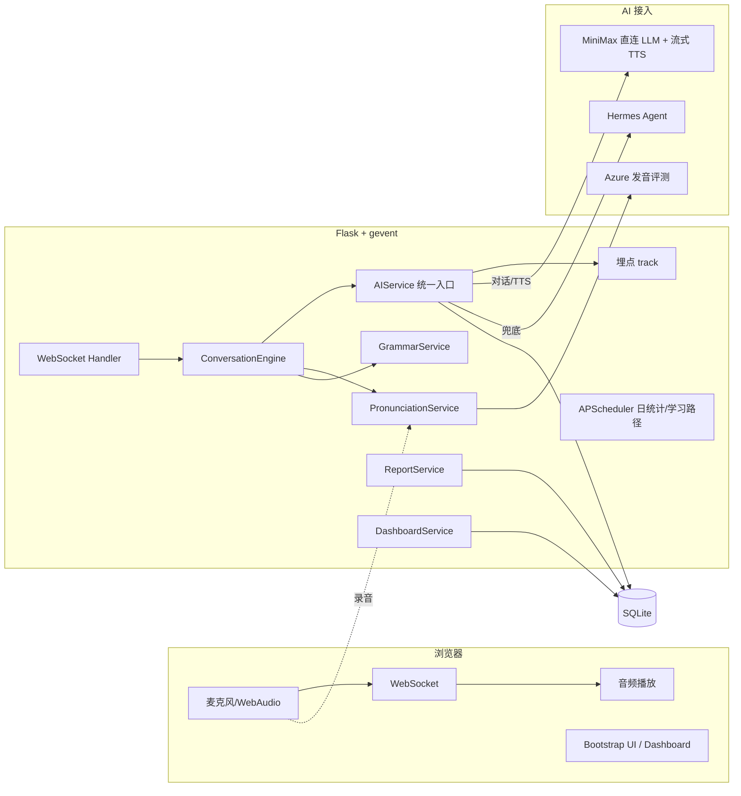
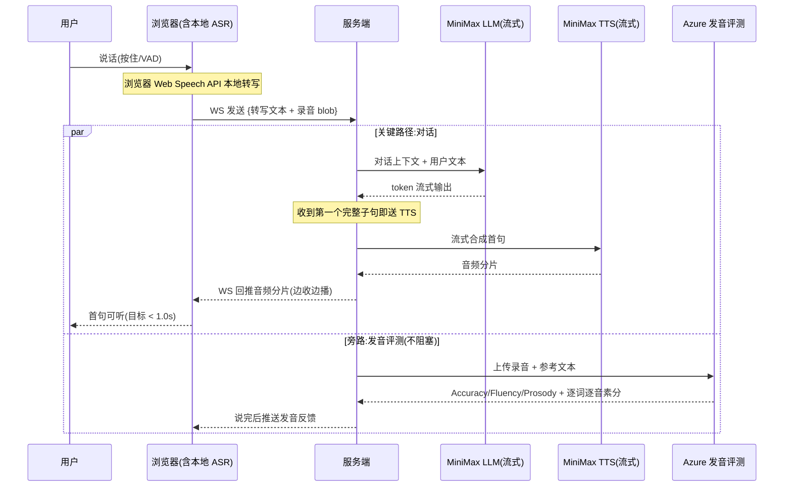
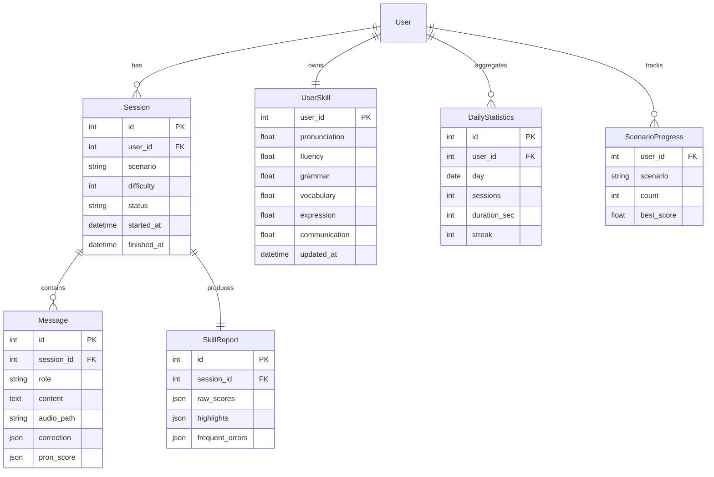

# SpeakMate — AI 英语口语陪练 · 设计文档

| 项 | 内容 |
|---|---|
| Version | 3.1 |
| Runtime | Python 3.11 |
| Backend | Flask + gevent(WebSocket) |
| Frontend | Bootstrap 5 + Jinja2 + 原生 WebAudio |
| Storage | SQLite |
| 定时任务 | APScheduler |
| 对话 LLM | MiniMax 直连(`api.minimaxi.com/anthropic`,文本) |
| TTS(AI 开口) | MiniMax 流式 TTS(`wss://api.minimaxi.com/ws/v1/t2a_v2`) |
| ASR(用户语音→文本) | 浏览器 Web Speech API(主,在延迟关键路径)/ MiniMax STT(可选) |
| 发音评测 | **Azure Pronunciation Assessment**(真·音素级 GOP) |
| LLM 兜底 | Hermes Agent 平台(MiniMax-M3 / glm-5.1 / kimi-k2.5) |
| 仓库 | `git@github.com:zhoutingunl/speak_mate.git` |

> **接入选型说明(均经实测/文档核对):** MiniMax 文本对话与流式 TTS 已实测可用;MiniMax **不提供** ASR/发音评测产品(其聊天端点收不到音频,文档仅有 TTS/声音克隆)。因此 ASR 走浏览器原生(零网络跳、零成本),**发音评测改用 Azure**——业界标准的音素级评测,一次调用返回转写 + Accuracy/Fluency/Completeness/Prosody + 逐词逐音素分。详见 §9、§12。

> 设计原则:**先把一条「语音对话 → 真发音评测 → 纠错 → 课后总结」的闭环做真做稳,再做广。** 凡是技术上拿不到真实数据的能力,宁可砍掉或降级标注,绝不在 demo / README 里"声称但不可用"。

---

## 目录

1. [项目简介](#1-项目简介)
2. [用户洞察与产品定位](#2-用户洞察与产品定位)
3. [用户画像](#3-用户画像)
4. [MVP 取舍与边界(重要)](#4-mvp-取舍与边界重要)
5. [核心功能](#5-核心功能)
6. [创新点](#6-创新点)
7. [系统架构](#7-系统架构)
8. [语音端到端架构与延迟预算(核心)](#8-语音端到端架构与延迟预算核心)
9. [AI 接入层设计](#9-ai-接入层设计)
10. [Prompt 设计](#10-prompt-设计)
11. [对话引擎设计](#11-对话引擎设计)
12. [发音评测设计(诚实链路)](#12-发音评测设计诚实链路)
13. [纠错策略](#13-纠错策略)
14. [六维能力模型与评分算法](#14-六维能力模型与评分算法)
15. [学习路径与 Dashboard](#15-学习路径与-dashboard)
16. [错误处理与降级设计](#16-错误处理与降级设计)
17. [QoS 指标](#17-qos-指标)
18. [Evaluation Framework](#18-evaluation-framework)
19. [埋点设计](#19-埋点设计)
20. [数据模型(ER)](#20-数据模型er)
21. [项目结构](#21-项目结构)
22. [测试设计](#22-测试设计)
23. [Demo 设计](#23-demo-设计)
24. [商业化思考](#24-商业化思考)
25. [安全设计](#25-安全设计)
26. [Git 工程规范](#26-git-工程规范)
27. [AI 协作说明](#27-ai-协作说明)
28. [Definition of Done](#28-definition-of-done)

---

## 1. 项目简介

SpeakMate 是一款 **AI 英语口语训练平台**,帮助用户在**指定场景**下进行真实对话训练。

支持场景:面试 / 点餐 / 酒店入住 / 商务会议 / 海关问答 / 日常聊天,并支持自定义场景。

围绕场景对话提供四件事的闭环:**实时语音对话 → 发音评测 → 语法/表达纠错 → 课后总结与成长分析**。

---

## 2. 用户洞察与产品定位

**洞察**:用户缺的不是英语知识,而是**真实的、低社交压力的语言环境**。传统路径"背单词 → 刷题 → 看视频"始终停在"知道"，跨不到"会说"。

**SpeakMate 要解决的就是「知道 → 会说」之间的鸿沟。**

**定位**:不是聊天机器人,不是翻译软件,而是一个**有反馈、可量化、能复训的 AI 英语私教**。

**核心价值**:让用户**敢说 → 会说 → 说得自然**,并用数据让"进步"看得见。

---

## 3. 用户画像

| 人群 | 典型诉求 | 主打场景 |
|---|---|---|
| 学生 | 四六级 / 雅思 / 托福 / 升学面试 | Interview、Daily Chat |
| 职场用户 | 商务沟通、海外会议、客户对接 | Meeting |
| 出国用户 | 旅行/居留中的真实交流 | Restaurant、Hotel、Immigration |

---

## 4. MVP 取舍与边界(重要)

评分明确要求"**能否做减法而非加法**、产品取舍是否自洽"。本项目为有限工期的个人作品,**刻意收敛范围,保证核心闭环真能跑**,而非样样半成品。

### P0 — 必做且必须真能跑通(demo 主线)
- **2 个场景**(Interview + Restaurant)的完整对话。
- **实时语音**:录音 → ASR → LLM 回复 → TTS 播放,首句流式可听。
- **真发音评测**:基于用户**真实音频**的多维评分(详见 §12)。
- **语法/表达纠错**:延迟纠错为主,结构化反馈。
- **课后总结**:本次会话的亮点 / 高频错误 / 推荐表达 / 训练建议。

### P1 — 时间允许则做(加分,非阻断)
- 更多场景(Hotel / Meeting / Immigration / Daily Chat)、自定义场景。
- Dashboard(雷达图 + 成长曲线 + 场景覆盖率)。
- 六维能力模型持久化与自适应推荐。

### P2 — 本期明确不做(并写清"为什么不做")
- **A/B Test 在线实验**:单人作品没有真实流量,跑不出统计显著的结论,硬塞一个空框架属于"做加法凑功能"。**本期只保留可切换的策略开关(实时/延迟纠错、严格/鼓励式 Prompt)和离线对照评测,不做在线分流。**
- **企业版多租户 / 团队管理**:与个人作品核心价值无关,属于商业畅想,放在 §24 文字说明即可,不进代码。
- **App / 小程序端**:Web 已能完整演示价值,多端是工程量陷阱。

> 取舍逻辑:**深度 > 广度**。先用 2 个场景把"对话自然度、语音流畅度、纠错精准度、可量化反馈"四个评审关注点打穿,再横向扩场景(扩场景几乎是纯配置成本)。

---

## 5. 核心功能

### 5.1 场景训练
内置 Interview / Restaurant / Hotel / Meeting / Immigration / Daily Chat,每个场景由一份**场景配置**(角色设定、目标、难度梯度、常用表达)驱动,新增场景=加一份配置,无需改代码。支持用户自定义场景(填角色 + 目标即可)。

### 5.2 实时语音
- **按住说话**(push-to-talk):最稳,P0 默认。
- **连续模式**(VAD 自动断句):P1,体验更自然。

### 5.3 发音评测
基于 Azure 音素级评测输出四维分:**Pronunciation / Fluency / Prosody / Completeness**,见 §12。

### 5.4 语法 / 表达纠错
识别时态、介词、冠词、主谓一致等;表达优化如 `I very like it → I really like it`。见 §13。

### 5.5 课后总结
结构化输出:优秀表达、高频错误、推荐表达、下次训练建议。

### 5.6 成长报告
7 / 30 / 90 天维度的能力变化与训练量统计(依赖 P1 的能力模型)。

---

## 6. 创新点

| 创新点 | 说明 | 与评审关注点的对应 |
|---|---|---|
| **六维能力画像** | Pronunciation / Fluency / Grammar / Vocabulary / Expression / Communication,每维 0~100 | "口语能力提升的可量化反馈" |
| **自适应训练** | 发现弱项 → 自动推荐专项场景与表达 | 训练闭环 |
| **场景覆盖率** | 统计训练过的场景,引导均衡成长 | 量化反馈 |
| **成长曲线** | 可视化能力提升趋势 | 量化反馈 |
| **音素级发音评测** | Azure 真音素级 GOP + 可替换 `PronunciationProvider` 接口 | 纠错/评测精准度、工程素养 |

---

## 7. 系统架构



**分层原则**:业务代码**只依赖 `AIService` 抽象**,禁止直接调用任何模型 SDK / HTTP。模型路由、流式、重试、降级、埋点全部收敛在接入层(见 §9、§16)。

---

## 8. 语音端到端架构与延迟预算(核心)

题目核心是"语音端到端流畅性和延迟性"。两个关键设计:
1. **全链路流式 + 首句优先**:LLM 边出边切句送 TTS,不等整段。
2. **会话 ASR 与发音评测错峰**:浏览器本地 ASR 在延迟关键路径上(零网络跳)立即驱动 LLM;同一段录音**异步**送 Azure 做发音评测,作为"说完后的反馈"返回,**不阻塞对话**(本就属于延迟纠错,见 §13)。

### 8.1 数据流



### 8.2 延迟预算(首句可听 = 各跳之和)

| 阶段 | 预算 | 关键手段 |
|---|---|---|
| 浏览器本地 ASR 出 final 文本 | ~150ms | Web Speech API 本地识别,无网络往返 |
| 文本到达服务端 | ~50ms | WS 发文本(轻量),录音 blob 走旁路不挡道 |
| LLM 首个完整子句 | ~500ms | 流式输出 + 精简上下文(最近 N 轮,见 §11) |
| TTS 首句音频分片 | ~250ms | 流式 TTS,按子句切分 |
| 网络回传 + 起播缓冲 | ~50ms | 双缓冲,首块即播 |
| **首句可听合计** | **~1.0s** | ASR 本地化后,瓶颈集中在 LLM 首句 + TTS 首片 |

> **指标是从设计推导出来的,不是拍脑袋。** §17 的 QoS 数字均以本预算为依据;若实测达不到,文档会如实更新而非美化。

### 8.3 关键工程点
- **首句优先**:LLM 输出按句号/逗号切句,合一句送一句 TTS,显著降低"开口"延迟。
- **打断(barge-in)**:用户在 AI 说话时开口,立即 cancel 当前 TTS 流(P1)。
- **背压**:WS 发送队列积压时丢弃过期音频分片,保证实时性优先于完整性。

---

## 9. AI 接入层设计

### 9.1 统一入口 `AIService`

```python
class AIService:
    def chat_stream(self, messages, *, scenario, level) -> Iterator[str]: ...   # MiniMax LLM
    def synthesize_stream(self, text) -> Iterator[bytes]: ...                    # MiniMax TTS
    def score_pronunciation(self, audio, ref_text) -> PronScore: ...            # Azure,见 §12

# ASR 主路在浏览器(Web Speech API),服务端只在降级时才需要 transcribe()
```

### 9.2 各能力的接入与兜底

| 用途 | 主 | 兜底 |
|---|---|---|
| 对话 LLM | MiniMax 直连(`/anthropic`,流式) | Hermes(MiniMax-M3 / glm-5.1 / kimi-k2.5) |
| TTS | MiniMax 流式 TTS(`wss .../t2a_v2`) | 浏览器 `SpeechSynthesis`(降级) |
| ASR | 浏览器 `Web Speech API`(本地、低延迟) | MiniMax STT(可选)/ Azure 识别结果复用 |
| **发音评测** | **Azure Pronunciation Assessment** | 透明降级:仅给 Fluency 近似 + 标注"数据不足"(见 §12.4) |
| 纠错 / 总结 | MiniMax 或 Hermes | Hermes 跨 plan 故障转移 |

- **MiniMax 直连**:对话走 Anthropic 兼容端点 `https://api.minimaxi.com/anthropic`(已实测文本可用);TTS 走 `wss://api.minimaxi.com/ws/v1/t2a_v2`(已实测可用)。密钥经环境变量注入(§25),**绝不入库**。
- **Azure**:Speech 服务的 Pronunciation Assessment,一次调用同时给转写与评分;区域 + key 走 `.env`。
- **Hermes**:走 `/api/session/new → /api/chat/start → SSE stream`,需自动批准工具、加 deadline + 首事件看门狗、429 跨 plan 切换、409 作废脏会话(参照 `hermes_webui` 技能踩坑清单)。Hermes 因有 Agent/工具开销,延迟高于直连,故仅作**兜底**用,不进实时语音主链路。

> **为什么 ASR 放浏览器而非 MiniMax**:实测 MiniMax 聊天端点收不到音频,其文档也只有 TTS/克隆、无官方 ASR 保障;浏览器 Web Speech API 本地识别零网络跳、零成本,直接砍掉一段关键路径延迟。若后续确认 MiniMax/Azure STT 更准,`AIService` 已留 `transcribe()` 接口可平滑切换。

### 9.3 鉴权与配置
所有密钥/base_url 来自 `.env`(见 §25),`AIService` 启动时校验缺失即 fail-fast 并打印可读提示;**缺 key 时自动进入 Mock 模式**(返回固定示例数据),让评审无凭证也能把项目跑起来。

---

## 10. Prompt 设计

Prompt 分层拼装:`System → Scenario → History → UserLevel → LearningGoal → CurrentMessage`。

示例(Interview,B1):

```
You are a professional but friendly English interviewer.
The candidate's level is B1; keep questions concise and natural.
Stay in role; ask one question at a time.
Do NOT correct mid-conversation. After the candidate answers,
if there is a major error, append a short structured note.
Output JSON: {reply, correction?: {original, reason, suggestion}}
```

- **结构化输出**:对话回复与纠错分离,前端可分别渲染、便于埋点统计接受率。
- **难度自适应**:`UserLevel` 由能力模型注入,L1~L5 对应措辞复杂度与语速提示。

---

## 11. 对话引擎设计

`ConversationEngine` 维护:`Session / ConversationHistory / Scenario / Difficulty`。

- **上下文窗口**:保留最近 **N=10 轮**(token 预算与延迟权衡;早期对话做摘要压缩,避免无界增长拖慢首句)。
- **难度 L1~L5**:控制 AI 用词、句长、语速提示与纠错强度。
- **会话状态机**:`init → speaking → thinking → replying → idle`,与 §8 的 barge-in / 背压协同。

---

## 12. 发音评测设计(Azure 音素级)

> **选型说明(已核实):** MiniMax 不提供发音评测,其聊天端点实测收不到音频。发音评测采用 **Azure Cognitive Services Speech — Pronunciation Assessment**,这是业界成熟的**音素级 GOP**方案:给定用户录音 + 参考文本,一次调用返回**转写 + 逐词 + 逐音素**的准确度、流利度、完整度、韵律分。**评测分数来自真实声学分析,不是让 LLM 看文本猜分**——从根上杜绝"谎报核心功能"。

### 12.1 Azure 原生维度 → 产品四维映射

Azure 直接返回 `AccuracyScore / FluencyScore / CompletenessScore / ProsodyScore`(均 0~100),映射到产品展示的四维:

| 产品维度 | 权重 | 来源(Azure 字段) |
|---|---|---|
| Pronunciation | 40% | `AccuracyScore`(逐音素准确度聚合) |
| Fluency | 30% | `FluencyScore`(语速/停顿/卡顿) |
| Stress / 韵律 | 15% | `ProsodyScore`(重音、节奏、语调,Azure 韵律评测) |
| Completeness | 15% | `CompletenessScore`(是否读全,漏词检测) |

> 维度从早期"Intonation"调整为 Azure 实际可取的 **Prosody + Completeness**——**只展示拿得到真实数据的维度**,不臆造模型给不出的指标。
>
> 总分 = 加权和(0~100);UI 同时给**逐词高亮**(Azure 的 word-level error type:漏读 Omission / 多读 Insertion / 读错 Mispronunciation)与**问题音素**列表,反馈可定位到具体单词/音素。

### 12.2 调用方式(Azure Speech SDK,服务端)

```python
import azure.cognitiveservices.speech as speechsdk

def score(self, audio_path: str, ref_text: str) -> PronScore:
    cfg = speechsdk.SpeechConfig(subscription=KEY, region=REGION)
    audio = speechsdk.audio.AudioConfig(filename=audio_path)
    pa = speechsdk.PronunciationAssessmentConfig(
        reference_text=ref_text,
        grading_system=speechsdk.PronunciationAssessmentGradingSystem.HundredMark,
        granularity=speechsdk.PronunciationAssessmentGranularity.Phoneme,
        enable_miscue=True)          # 开启漏读/多读检测
    pa.enable_prosody_assessment()   # 韵律(重音/语调)
    recog = speechsdk.SpeechRecognizer(speech_config=cfg, audio_config=audio)
    pa.apply_to(recog)
    result = recog.recognize_once()  # 同时拿到转写 + 评分
    return PronScore.from_azure(result)   # 逐词逐音素结构化
```

- **参考文本来源**:朗读模式给定目标句;自由对话模式用「浏览器 ASR 的转写」作为参考文本(Azure 支持无脚本评测),再做发音打分。
- **音频格式**:16k/单声道 WAV/PCM,与端上录音一致(§8)。

### 12.3 抽象接口(可扩展)

发音评测藏在 `PronunciationProvider` 抽象之后,便于将来换/比引擎:

```python
class PronunciationProvider(Protocol):
    def score(self, audio: bytes, ref_text: str) -> PronScore: ...

class AzureProvider:    # 默认:音素级 GOP
class IFlytekProvider:  # 预留:讯飞,中文环境时备选(本期不实现)
class ProxyProvider:    # 降级:见 12.4
```

### 12.4 降级策略(透明,不伪装)
Azure 不可用(超时/无凭证/无网)时,退化为**代理分**:用浏览器 ASR 置信度 + 语速 + 停顿时长估算 Fluency,其余维度给"数据不足"占位,并**在 UI 明确标注「降级评分,仅供参考」**——绝不把代理分伪装成真评测。Mock 模式(无任何 key)返回固定示例分,并同样标注。

---

## 13. 纠错策略

| 模式 | 行为 | 适用 |
|---|---|---|
| **延迟纠错(默认)** | 一轮答完后给结构化反馈,不打断 | 保护对话自然度与"敢说" |
| **实时纠错** | 仅"重大错误"即时轻提示 | 高强度训练偏好 |

反馈三段式:**错误句 → 原因 → 推荐表达**。"重大错误"由规则 + 模型判定(影响语义/反复出现的系统性错误才即时提示),避免频繁打断带来的挫败感——这正是"纠错时机"的取舍。

---

## 14. 六维能力模型与评分算法

`UserSkill`:Pronunciation / Fluency / Grammar / Vocabulary / Expression / Communication,各 0~100。

### 14.1 更新算法(可解释、抗抖动)
每次会话产出本次六维原始分 `raw_i`,用**指数加权移动平均(EWMA)**更新长期画像,降低单次波动影响:

```
score_i = α * raw_i + (1 - α) * score_i_prev     # α = 0.3
```

- 单维 `raw` 来源:Pronunciation/Fluency 来自 §12;Grammar 来自纠错命中率;Vocabulary 来自用词丰富度(去重词数/TTR);Expression 来自地道表达比例;Communication 来自会话完成度与轮次有效性。
- **冷启动**:首次会话 α=1 直接采用 raw,并标注"样本不足"。
- **可追溯**:每次更新写入 `SkillReport`,Dashboard 成长曲线据此绘制。

---

## 15. 学习路径与 Dashboard

### 15.1 学习路径(APScheduler 每日生成)
依据六维短板自动产出:每日任务、推荐场景、推荐表达、专项训练。

### 15.2 Dashboard(`/dashboard`)
展示:练习次数、训练时长、连续打卡、**能力雷达图**、**成长曲线**、错误统计、**场景覆盖率**。

---

## 16. 错误处理与降级设计

评审明确看"边界与错误处理"。各失败点都有可观察的降级,而非崩溃:

| 失败点 | 处理 |
|---|---|
| MiniMax LLM 超时/429 | 重试一次 → 切 Hermes 兜底 → 仍失败则返回友好提示并 `ai_error` 埋点 |
| ASR 返回空/置信度过低 | 提示"没听清,请再说一遍",不进入 LLM |
| TTS 失败 | 回退浏览器 `SpeechSynthesis`,文本照常展示 |
| 浏览器 ASR 不支持/识别空 | 提示换 Chrome 或"没听清,请再说一遍";可选回退 MiniMax STT |
| Azure 发音评测超时/无凭证 | 走 §12.4 透明降级(代理分 + UI 标注),不阻塞对话 |
| WebSocket 断开 | 端上自动重连 + 会话续接(session_id 保持) |
| Hermes 卡死/409 | cancel + 作废脏会话 + 重建(参照踩坑清单) |
| 缺少 API Key | 启动 fail-fast 提示;运行期进入 Mock 模式可演示 |

---

## 17. QoS 指标

| 指标 | 目标 | 依据 |
|---|---|---|
| 首句可听延迟 | < 1.0s | §8.2 延迟预算推导(ASR 本地化后) |
| 平均响应 | < 2s | 流式 + 首句优先 |
| P95 响应 | < 3s | 含网络抖动余量 |
| 对话成功率 | > 95% | 含兜底重试 |
| WebSocket 稳定性 | > 99% | 自动重连 |
| 发音评测往返 | < 1.5s | 旁路异步,不计入对话延迟 |

> 旧版写的"首包 <800ms"在串行链路下不可达;ASR 移到浏览器本地后,据 §8 预算修正为"**首句可听 <1.0s**",诚实优先。

---

## 18. Evaluation Framework

**离线、可复现**的评测(不依赖在线流量),这是量化反馈的取证关键。

| 指标 | 定义 | 目标 | 数据来源 |
|---|---|---|---|
| 发音评测有效性 | Azure 评分与人工评分的相关性(Pearson r) | r > 0.7 | **手工标注 30 条**音频(高/中/低发音各档)对照 Azure 输出 |
| Grammar Precision | 纠错正确数 / 纠错总数 | > 90% | 50 条含错句构造集 + 人工判定 |
| Session Completion Rate | 完成训练会话比例 | > 80% | 埋点 |
| User Acceptance Rate | 采纳建议比例 | > 70% | 埋点(纠错卡片"采纳"按钮) |
| Repeat Usage Rate | 7 天复训率 | > 50% | 埋点 |

> **发音评测一项不再"自证准确率"**:Azure 的音素级 GOP 本身即业界基线,我们要验的是"它的分与人感受是否一致",故改用**相关性**指标,更诚实也更有信息量。
> 标注集随仓库提交(`data/eval/`,音频脱敏),评测脚本 `tests/eval/` 一键复跑——让数字有据可查,而非空话。

策略对照(离线,非在线 A/B):实时 vs 延迟纠错、严格 vs 鼓励式 Prompt,在同一标注集上比较接受率/完成率,产出对照报告。

---

## 19. 埋点设计

统一 SDK:`track(event, payload)`,异步落 SQLite。

| 域 | 事件 |
|---|---|
| Session | `session_start` / `session_finish` |
| Voice | `voice_start` / `voice_finish` / `voice_error` |
| AI | `ai_reply` / `ai_error` / `ai_latency`(含各跳耗时) |
| Correction | `grammar_fix` / `pronunciation_fix` / `suggestion_accept` |
| Dashboard | `dashboard_open` / `dashboard_refresh` |

`ai_latency` 记录 ASR/LLM/TTS 分段耗时,直接喂给 §17 的 QoS 看板。

---

## 20. 数据模型(ER)



---

## 21. 项目结构

```
speakmate/
├── app.py                 # Flask 入口
├── config.py              # 配置(读 .env)
├── db.py                  # SQLite 封装
├── websocket_server.py    # WS 语音通道
├── ai/
│   ├── service.py         # AIService 统一入口
│   ├── minimax.py         # 直连:LLM + 流式 TTS
│   ├── hermes.py          # 兜底 Agent
│   └── mock.py            # 无 key 时的 Mock
├── conversation.py        # 对话引擎
├── pronunciation.py       # 发音评测(PronunciationProvider:Azure/降级)
├── grammar.py             # 纠错
├── report.py              # 课后总结 + 六维更新
├── dashboard.py
├── scheduler.py           # APScheduler 学习路径/日统计
├── tracking.py            # 埋点
├── templates/  static/
├── tests/      tests/eval/
├── data/eval/             # 标注集(脱敏)
├── design.md   README.md  .env.example  .gitignore
```

---

## 22. 测试设计

- 框架:`pytest` + `pytest-cov`。
- 覆盖率门槛:**Line > 85% / Function > 85% / Branch > 80%**(以核心模块为准,UI/胶水代码不强求)。
- 必覆盖:`AIService`(含 Mock 路径)、Conversation、Grammar、Pronunciation(含降级)、Report、Dashboard、Store。
- AI 调用在单测中走 Mock,**不打真实接口**,保证 CI 可离线复跑。
- `tests/eval/` 跑 §18 离线评测,产出指标报告。

---

## 23. Demo 设计

5~8 分钟,主线:**场景选择 → 实时语音对话(展示首句延迟)→ 发音评分(展示 Azure 逐词/逐音素高亮)→ 语法/表达纠错 → 课后总结 → 成长报告 / Dashboard**。

录制要点:**真实操作、真实接口返回**,不剪辑伪造;若某段走了降级/Mock,口播说明。

---

## 24. 商业化思考

| 版本 | 内容 | 价值假设 |
|---|---|---|
| 免费版 | 每日 10 分钟、基础场景 | 获客、验证留存 |
| 会员版 | 无限训练 + 雅思/面试/商务专项 | 为"考试/求职刚需"付费 |
| 企业版(畅想,不实现) | 员工英语培训、团队能力评估 | B 端按席位收费 |

**为什么先做 C 端个人闭环而非 B 端**:个人作品验证"训练→提升"的产品内核成本最低;B 端依赖团队管理、合规、销售,属于商业化后期,本期仅文字论证(对应 §4 P2 取舍)。

---

## 25. 安全设计

- **绝不入库**:`MINIMAX_API_KEY`、`AZURE_SPEECH_KEY`、Hermes 认证、AccessToken、Cookie 等一切凭证。
- 统一从 `.env` 读取;仓库只提交 `.env.example`(占位,无真值)。
- `.gitignore` 覆盖 `.env`、`*.sqlite`、`data/audio/`、缓存。
- 提交前 `git secrets` / 简易正则钩子扫描,防误提交密钥。
- 用户音频脱敏存储,评测样本去标识。

`.env.example`:
```
# 对话 LLM + TTS
MINIMAX_BASE_URL=https://api.minimaxi.com/anthropic
MINIMAX_API_KEY=replace-me
# 发音评测
AZURE_SPEECH_KEY=replace-me
AZURE_SPEECH_REGION=eastasia
# 兜底
HERMES_BASE=http://10.210.32.30:8787
```

---

## 26. Git 工程规范

- **禁止直接在 main 开发**:Feature Branch → PR → Review → Merge。
- **PR 原则**:**每个 PR 是一个可独立 review 的完整改动**(一个功能/一次重构/一组测试),不为凑数拆分,也不一次性大提交。让 `git log` 能自然看出迭代过程。
- Commit message 中文,语义化前缀:

```
功能: 实现 Interview 场景对话引擎
功能: 接入 MiniMax 流式 TTS
修复: 修正 ASR final 触发时机
测试: 补充发音评测降级路径用例
文档: 更新语音端到端延迟预算
```

---

## 27. AI 协作说明

本项目在开发中使用了 AI 辅助工具,如实声明:

- **允许使用**:Hermes、Claude Code、Codex、Cursor、OpenHands 等。
- **运行时 AI 能力**:对话/纠错/总结由 MiniMax(主)与 Hermes(兜底)提供;TTS 由 MiniMax 流式语音提供;ASR 由浏览器 Web Speech API 提供;发音评测由 **Azure Pronunciation Assessment** 提供。
- **选型有据**:发音评测最初设想用 MiniMax 多模态,经**实测确认 MiniMax 聊天端点收不到音频、且无发音评测产品**后,改接 Azure 音素级方案——决策过程与证据记录在设计迭代中,非事后包装。
- **承诺**:① 理解所采用方案的优缺点(尤其 §12 发音评测的精度边界);② 提交的功能均可运行,测试真实通过;③ README / demo 所述能力与代码一致,**不伪造功能、不伪造测试与演示**;④ 走了降级/Mock 的地方,文档与 UI 如实标注。

> README 中将保留同名「## AI 协作说明」段落,逐条对应上述声明。

---

## 28. Definition of Done

**P0(必达)**
- [ ] Interview + Restaurant 两场景对话可跑通
- [ ] 实时语音端到端流式,首句可听 < 1.0s(实测记录)
- [ ] 发音评测基于真实音频,降级路径透明标注
- [ ] 语法/表达纠错,结构化反馈
- [ ] 课后总结输出
- [ ] 缺 key 可进入 Mock 模式跑起来
- [ ] 核心模块覆盖率 > 85%
- [ ] README 可让人一键跑起来 + 含「AI 协作说明」
- [ ] design.md 与实现一致
- [ ] Demo 视频(5~8 分钟,真实演示)

**P1(加分)**
- [ ] 六维能力模型持久化 + Dashboard 可视化
- [ ] 更多场景 / 自定义场景
- [ ] Evaluation Framework 离线指标 + 标注集入库

**工程过程**
- [ ] 所有改动经 Feature Branch → PR → Merge,PR 可独立 review
- [ ] 无密钥入库(钩子校验通过)
